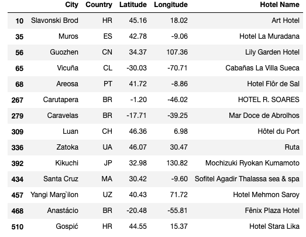

# Vacation Weather Analysis with Python APIs

---

---

## Contact Information

Rob Savage 

rob.savage@me.com

[LinkedIn](https://www.linkedin.com/in/robsavage/)

[Tableau Public](https://public.tableau.com/profile/rob.savage)

---

## Project Description

The purpose of this exercise was to utilize APIs to analyze weather data from 500+ random countries and use that data to help automate what would be exhaustive travel destination research. 

---

## Tools Used

1. Python (Data Aggregation/Cleaning)

    - Pandas Library

2. Github (Publishing of Results and Analysis)

3. Jupyter Notebook

4. Matplotlib (Visualizations)

5. SciPy

---

## Steps 

1. Used `Python` to aggregate/clean data pulled from [OpenWeather](http://api.openweathermap.org) with `Pandas`. 

2. Once the data was inspected and cleaned, various plots with `Matplotlib` were created in order to inspect relationships among the different features. 

3. A cleaned `csv` was exported from the data frame

4. That new dataset was then opened in a new notebook, then appended with information from Google Maps

5. Utilizing a few filters to decide upon ideal weather conditions, the best cities were chosen

5. Google APIs was then utilized to find the nearest hotels in those few cities 

---

## Analysis

1. As advertised, there seems to be a strong correlation with humidity and temperature when getting close to the equator.

2. There doesn't seem to be any real correlation with wind speed and latitude, regardless of the hemisphere. 

3. There is a strong correlation with the north and levels of humidity, whether that be humidity that you feel or the overwhelming presence of rain.

